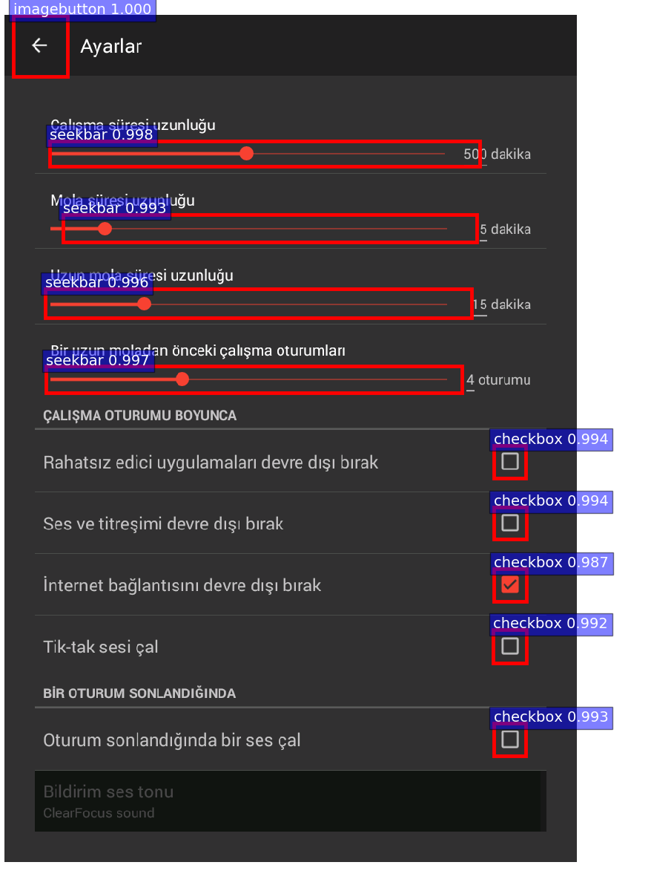

# Wireframe

## Introduction

This project is a pytorch implementation to wirify components in app runtime GUI screenshots by faster R-CNN. Based on the collected screenshots and wirified components, we build a web application [Gallery D.C.](http://mui-collection.herokuapp.com) to assist designers on getting inspiration on component-oriented practical designs.

**NOTE**. Our implementing is referred the above implementations, especially [jwyang/faster_rcnn.pytorch](https://github.com/jwyang/faster-rcnn.pytorch).

<!-- ## Tutorial

* [Blog](http://www.telesens.co/2018/03/11/object-detection-and-classification-using-r-cnns/) by [ankur6ue](https://github.com/ankur6ue) -->

## Preparation

First of all, clone the code
```
git clone https://github.com/u6063820/Wireframe.git
```

### prerequisites

* Python 3.6
* Pytorch 1.0
* CUDA 8.0 or higher

### Data Preparation

```
cd Data
python3 main.py
```

### Pretrained Model

We used two pretrained models in our experiments, VGG and ResNet101. You can download these two models from:

* VGG16: [Dropbox](https://www.dropbox.com/s/s3brpk0bdq60nyb/vgg16_caffe.pth?dl=0), [VT Server](https://filebox.ece.vt.edu/~jw2yang/faster-rcnn/pretrained-base-models/vgg16_caffe.pth)

* ResNet101: [Dropbox](https://www.dropbox.com/s/iev3tkbz5wyyuz9/resnet101_caffe.pth?dl=0), [VT Server](https://filebox.ece.vt.edu/~jw2yang/faster-rcnn/pretrained-base-models/resnet101_caffe.pth)

Download them and put them into the data/pretrained_model/.

### Compilation

Install all the python dependencies using pip:
```
pip install -r requirements.txt
```

Compile the cuda dependencies using following simple commands:

```
cd Src/lib
python3 setup.py build develop
```

It will compile all the modules you need, including NMS, ROI_Pooing, ROI_Align and ROI_Crop.

## Train

To train a faster R-CNN model with vgg16 on dataset, simply run:
```
CUDA_VISIBLE_DEVICES=$GPU_ID python trainval_net.py \
                   --dataset pascal_voc --net vgg16 \
                   --bs $BATCH_SIZE --nw $WORKER_NUMBER \
                   --lr $LEARNING_RATE --lr_decay_step $DECAY_STEP \
                   --cuda
```
where 'bs' is the batch size with default 1. 

## Test

If you want to evlauate the detection performance of a pre-trained vgg16 model on test set, simply run
```
python test_net.py --dataset pascal_voc --net vgg16 \
                   --checksession $SESSION --checkepoch $EPOCH --checkpoint $CHECKPOINT \
                   --cuda
```
Specify the specific model session, chechepoch and checkpoint, e.g., SESSION=1, EPOCH=6, CHECKPOINT=100.

## Detection Results

Below are some detection results:

<div style="color:#0000FF" align="center">
 


</div>

## Authorship

This project is contributed by [Sidong Feng](https://github.com/u6063820).

<!-- ## Citation

    @article{jjfaster2rcnn,
        Author = {Jianwei Yang and Jiasen Lu and Dhruv Batra and Devi Parikh},
        Title = {A Faster Pytorch Implementation of Faster R-CNN},
        Journal = {https://github.com/jwyang/faster-rcnn.pytorch},
        Year = {2017}
    }
 -->
